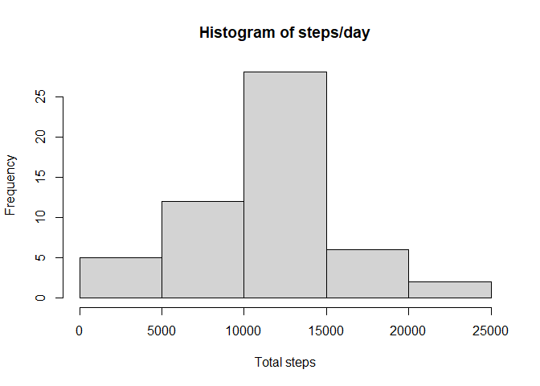
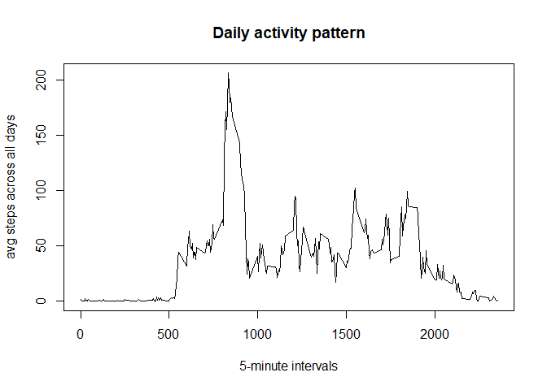
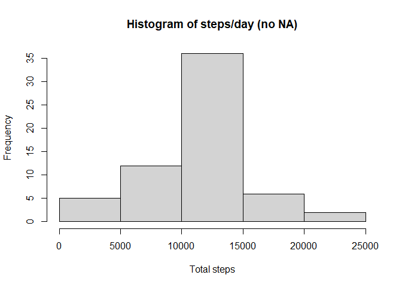
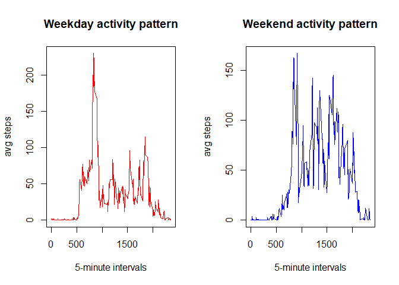

## Loading and preprocessing the data


```r
library(dplyr)
if(!file.exists("activity.csv")) {
  unzip("activity.zip")
}
f <- read.csv("activity.csv")
```

## What is mean total number of steps taken per day?


```r
summary <- f %>% 
           group_by(date) %>% 
           summarise(Total=sum(steps), Mean=mean(steps), Median=median(steps))
hist(summary$Total, main="Histogram of steps/day", xlab="Total steps")
```

<!-- -->

```r
summary
```

```
## # A tibble: 61 x 4
##    date       Total   Mean Median
##    <chr>      <int>  <dbl>  <dbl>
##  1 2012-10-01    NA NA         NA
##  2 2012-10-02   126  0.438      0
##  3 2012-10-03 11352 39.4        0
##  4 2012-10-04 12116 42.1        0
##  5 2012-10-05 13294 46.2        0
##  6 2012-10-06 15420 53.5        0
##  7 2012-10-07 11015 38.2        0
##  8 2012-10-08    NA NA         NA
##  9 2012-10-09 12811 44.5        0
## 10 2012-10-10  9900 34.4        0
## # ... with 51 more rows
```


## What is the average daily activity pattern?


```r
avg_step <- aggregate(f$steps, list(f$interval), mean, na.rm=TRUE)
colnames(avg_step) <- c("interval", "mean")
plot(avg_step, type='l', main="Daily activity pattern", xlab="5-minute intervals", ylab="avg steps across all days")
box()
```

<!-- -->


```r
max_interval <- avg_step[which.max(avg_step$mean),]$interval
```
The 5-minute interval that, on average, contains the maximum number of steps is the 835-th one.

## Imputing missing values

```r
count_na <- sum(!complete.cases(f))
```
There are 2304 missing values in the dataset. The missing values will be substituted with the mean for the interval they belong to.


```r
na <- f[!complete.cases(f), ]
nona <- f[complete.cases(f), ]
na2mean <- na
for(i in 1:nrow(avg_step)){
  na2mean$steps[na2mean$interval %in% avg_step$interval[i]] <- avg_step$mean[i]
}
nona <- rbind(na2mean, nona)
```


```r
summary2 <- nona %>% 
           group_by(date) %>% 
           summarise(Total=sum(steps), Mean=mean(steps), Median=median(steps))
hist(summary2$Total, main="Histogram of steps/day (no NA)", xlab="Total steps")
```

<!-- -->

```r
summary2
```

```
## # A tibble: 61 x 4
##    date        Total   Mean Median
##    <chr>       <dbl>  <dbl>  <dbl>
##  1 2012-10-01 10766. 37.4     34.1
##  2 2012-10-02   126   0.438    0  
##  3 2012-10-03 11352  39.4      0  
##  4 2012-10-04 12116  42.1      0  
##  5 2012-10-05 13294  46.2      0  
##  6 2012-10-06 15420  53.5      0  
##  7 2012-10-07 11015  38.2      0  
##  8 2012-10-08 10766. 37.4     34.1
##  9 2012-10-09 12811  44.5      0  
## 10 2012-10-10  9900  34.4      0  
## # ... with 51 more rows
```
Even though the mean and median has changed for the former NA observations, the over mean and median is unchanged (by definition) The general shape of the histogram did not change. However, the frequencies increased, particularity for the most "popular" step.

## Are there differences in activity patterns between weekdays and weekends?

```r
d <- nona %>% 
     mutate(day = weekdays(as.Date(nona$date))) %>% 
     mutate(week = factor(ifelse(day %in% c("Saturday", "Sunday"), "Weekend", "Weekday"), levels=c("Weekend", "Weekday")))
avg_step_wd <- with(subset(d, week=="Weekday"), aggregate(steps, list(interval), mean))
avg_step_we <- with(subset(d, week=="Weekend"), aggregate(steps, list(interval), mean))
```


```r
par(mfrow=c(1,2))
plot(avg_step_wd, type='l', main="Weekday activity pattern", xlab="5-minute intervals", ylab="avg steps", col="red")
plot(avg_step_we, type='l', main="Weekend activity pattern", xlab="5-minute intervals", ylab="avg steps", col="blue")
```

<!-- -->

